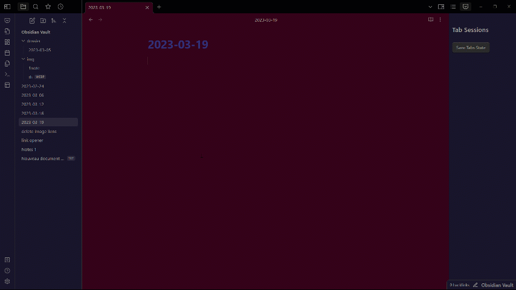
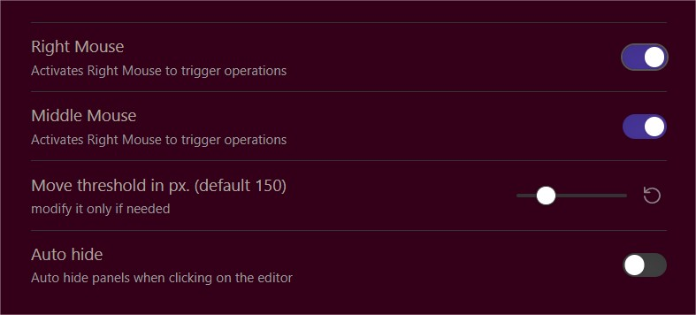

# Easy toggle sidebars 
  
> <strong>New</strong>:  
You can use <strong>Rightclick</strong> too  
AutoHide both sidebars option when clicking text content in the editor

* Toggle both sidebars by double-clicking Middle or Right mouse button.  
* Toggle each sidebar by clicking Middle or Right mouse button and moving toward the corresponding sidebar.  
* If using for example canvas, you can do toggling operations from the ribbon bar, using a vertical move and double clic 
* Command "Toggle both sidebars" added to the palette
* AutoHide option to automatically hide both sidebars when clicking on the editor text content/body. don't interfer with tags opening sidebar or in canvas, graphview...   
* Min editor width option to automatically close sidebar(s) when resizing window 
  

settings
