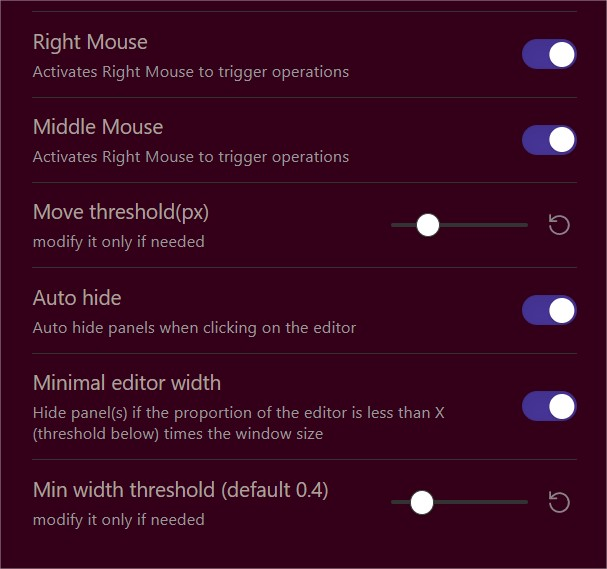

# Easy toggle sidebars 

With RightMouseButton or MiddleMouseButton :
- double click to toggle both sidebars
- click and move toward the sideBar you want to toggle
- you can do previous operations from the ribbon bar using double clic and vertical moves (up/down). useful in canvas...
- AutoHide to automatically hide sidebars when clicking on the editor
- ribbon bar autoHide button switcher
- if the editor width reach a minimal value, it reduces sidebars to their minimal size, and if it is still not enough, then sidebars are hidden.  
- Command "toggle both sidebars" added.	
    

  
autoHide with editor witdh

  
settings
